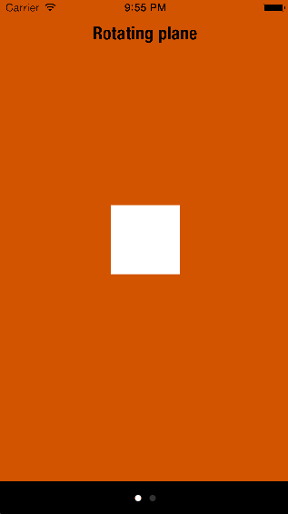
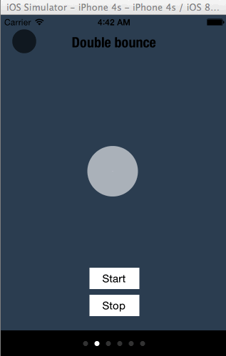
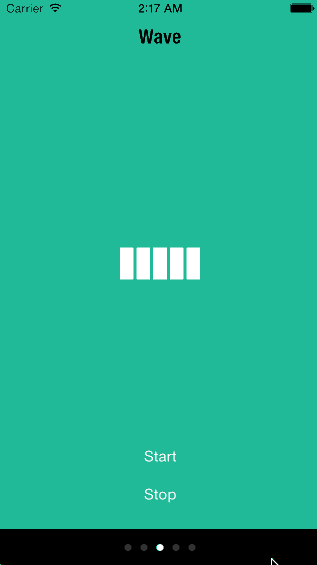
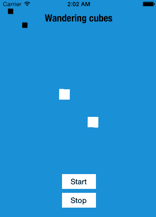
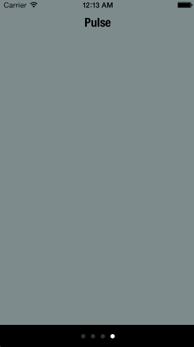
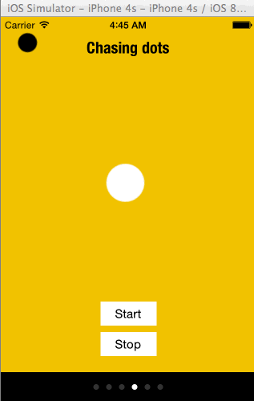
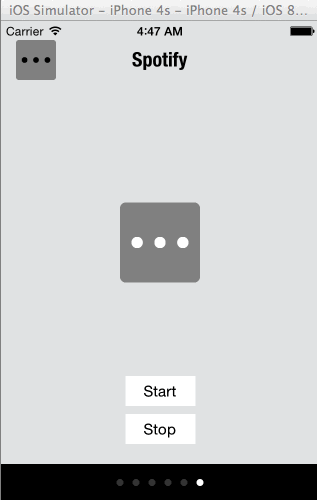
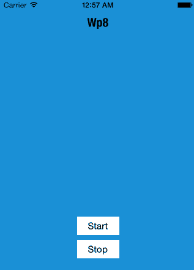

DTIActivityIndicatorView
========================

Animated custom ActivityIndicator inspired from css library SpinKit and much more... 
Written in Swift.

- DTIActivityIndicatorView can be called from both swift or objc project.
- This component require **Xcode6.1** to compile.

 &nbsp; 
 &nbsp;
 &nbsp;
 &nbsp;
 &nbsp;
 &nbsp;
 &nbsp;
 &nbsp;

### Installation
> For application targets that do not support embedded frameworks, such as iOS 7, DTIActivityIndicator can be integrated by including the `*.swift` source files directly.

_Due to the current lack of [proper infrastructure](http://cocoapods.org) for Swift dependency management, using DTIActivityIndicator in your project requires the following steps:_

1. Add DTIActivityIndicator as a [submodule](http://git-scm.com/docs/git-submodule) by opening the Terminal, `cd`-ing into your top-level project directory, and entering the command `git submodule add https://github.com/dtissera/DTIActivityIndicatorView-Swift.git`
2. Open the `DTIActivityIndicator` folder, and drag `DTIActivityIndicator.xcodeproj` into the file navigator of your app project.
3. In Xcode, navigate to the target configuration window by clicking on the blue project icon, and selecting the application target under the "Targets" heading in the sidebar.
4. Ensure that the deployment target of DTIActivityIndicator.framework matches that of the application target.
5. In the tab bar at the top of that window, open the "Build Phases" panel.
6. Expand the "Target Dependencies" group, and add `DTIActivityIndicator.framework`.
7. Click on the `+` button at the top left of the panel and select "New Copy Files Phase". Rename this new phase to "Copy Frameworks", set the "Destination" to "Frameworks", and add `DTIActivityIndicator.framework`.
8. If you are using this component in an `objc target`, flag ```Embedded Content Contains Swift Code``` in the `Build Settings` needs to be set to `YES`.

---

### Usage
DTIActivityIndicatorView is subclass of UIView. So you can add the instance to some view.
DTIActivityIndicatorView support storyBoards and new IBDesignable attributes

*swift*
```swift
let myActivityIndicatorView: DTIActivityIndicatorView = DTIActivityIndicatorView(frame: CGRect(x:0.0, y:0.0, width:80.0, height:80.0))
self.view.addSubview(myActivityIndicatorView)
myActivityIndicatorView.indicatorColor = UIColor.redColor()
myActivityIndicatorView.indicatorStyle = DTIIndicatorStyle.convInv(.chasingDots) 
myActivityIndicatorView.startActivity()
```

*objc*
```objc
DTIActivityIndicatorView *myActivityIndicatorView = [[DTIActivityIndicatorView alloc] initWithFrame:CGRectMake(0.0, 0.0, 80.0, 80.0)];
[self.view addSubview:myActivityIndicatorView];
myActivityIndicatorView.indicatorColor = [UIColor redColor];
myActivityIndicatorView.indicatorStyle = @"chasingDots";
[myActivityIndicatorView startActivity];
```

