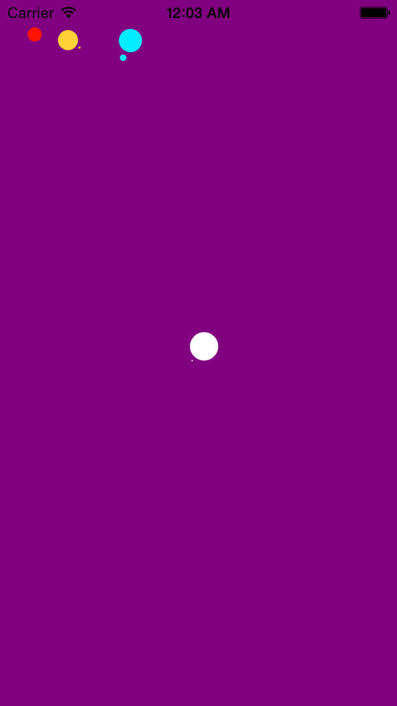

DTIActivityIndicatorView
========================

Animated custom ActivityIndicator inspired from css library SpinKit. Written in Swift.


### Installation
Support for swift project is not yet supported by cocoapod.
I will create a podspec file later.
DTIActivityIndicatorView will be available through [CocoaPods](http://cocoapods.org).
For instance, you will have to manually copy Classes/* in your project

You can see work progress here:
https://github.com/CocoaPods/CocoaPods/issues/2272


### Usage
DTIActivityIndicatorView is subclass of UIView. So you can add the instance to some view.
```swift
let myActivityIndicatorView: DTIActivityIndicatorView = DTIActivityIndicatorView(frame: CGRect(x:0.0, y:0.0, width:40.0, height:40.0))
self.view.addSubview(myActivityIndicatorView)
myActivityIndicatorView.indicatorColor = UIColor.redColor()
myActivityIndicatorView.startActivity()
```

